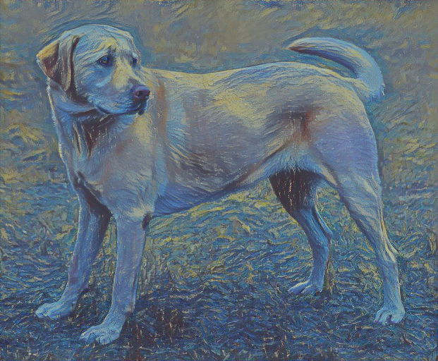
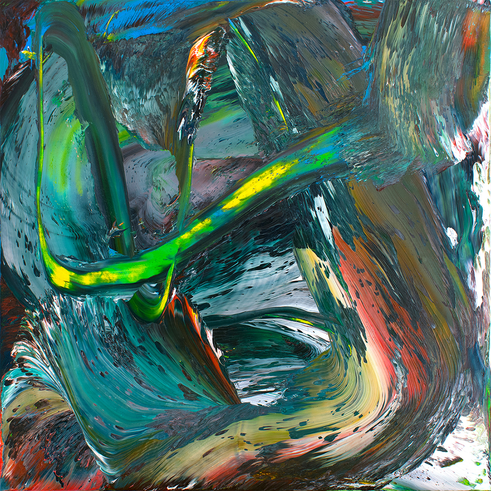
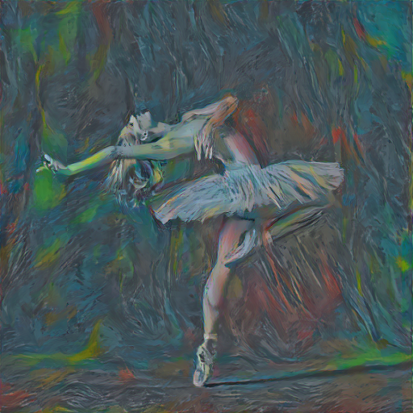
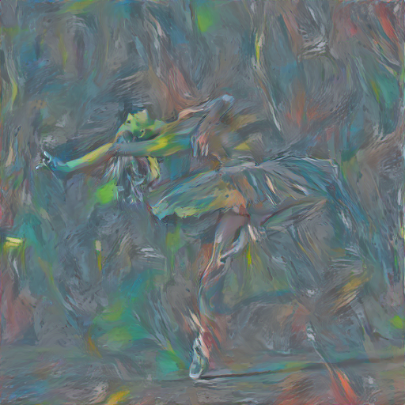
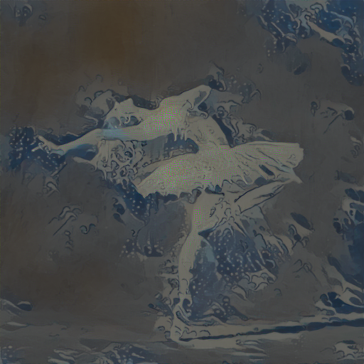
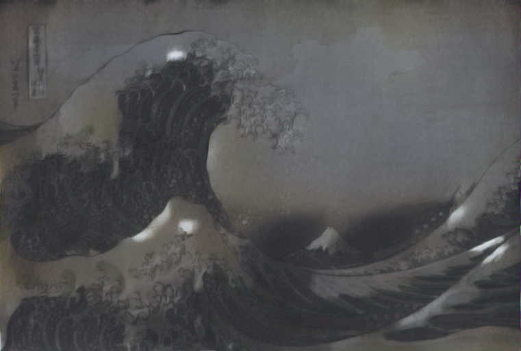
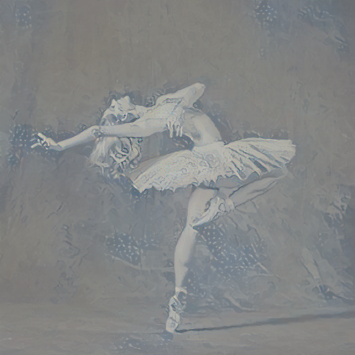
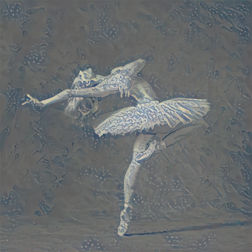

# PyTorch Neural Style Transfer

This repo contains a single notebook demonstrating how to perform neural style transfer in PyTorch. The notebook is intended to be a more readable version of the [official PyTorch neural style transfer tutorial](https://pytorch.org/tutorials/advanced/neural_style_tutorial.html) as that one contains too many abstractions for my liking.

Neural transfer involves using neural networks to generate an image that is based on the *content* of one image and the *style* of a second image.

As an example, we'll use the dog on the left as the content image and the painting on the right as the style image.

 
 

By running the neural style transfer algorithm with these two images we get the following:

 

As we can see, we get the content (dog) in the style as the second image (Picasso's Starry Night).

The whole process is iterative, therefore we can create an animation from each step:

 

This process generalizes to any content and style image, although results may vary. Here, we use different content and style images.

 
 

Again, the neural style transfer algorithm can be applied to transfer the style of the second image to the content of the first.

 

Like before, we can animate the process.

 

In the previous examples our generated image is "seeded" with the content image, i.e. the algorithm uses the content image as a starting off point to iteratively apply the style.

However, starting from the content image is not necessary. The below image is initialized as random noise but the dog will still appear as the model is conditioned on the content image.

 

From the animation we can see that the style is generated first and then the content slowly begins to appear.

 

We can also use the dancer as the content image and start from random noise:

 

Again, the style appears first, then the content.

 

One issue with neural style transfer is the presence of artifacts. Let's combine these two images: 

 
 

Below we can see the shoulder and skirt of the dancer are covered in artifacts.

 

These artifacts appear when the style image is too "busy", i.e. lots of high frequency areas in the image such as the froth of the waves in the style image. If we switch the content and style images around we get no artifacts.

 

One method of removing the artifacts is by reducing the weight of the style loss, `style_weight`, at the cost of reducing the amount of style transferred to the content. Here is the same content and style image but with the `style_weight` set to 100x less than before:

 

Another solution is to decrease the learning rate. Below is the image with the increased `style_weight` but with a 40x smaller learning rate:

 

### Requirements

- pytorch
- torchvision
- PIL
- matplotlib
- imageio ^
- pygifsicle ^

^ imageio is used to create gifs and pygifsicle is used to compress them. Both are optional.